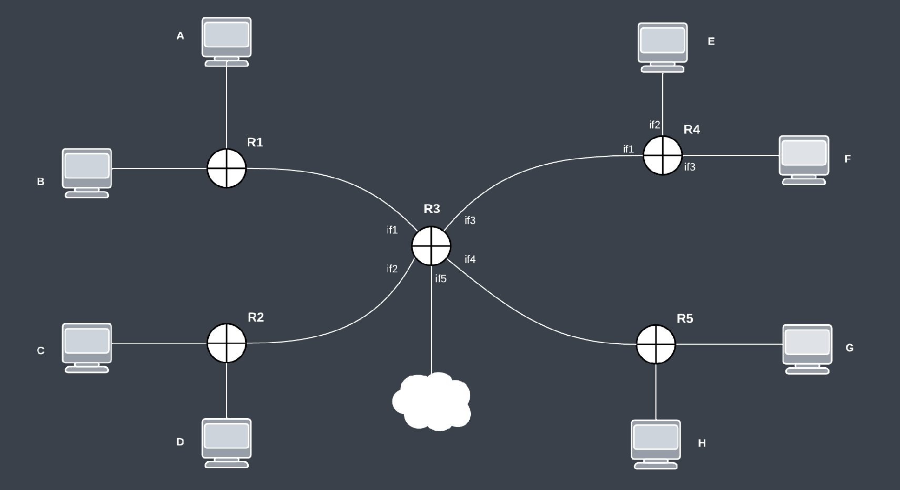

#  Enunciado evaluacion parcial 1C 2023 - Primera oportunidad

---

***Criterio de aprobación:***

*El alumno debe demostrar conocimiento de **todos** los puntos que componen el parcial*

---

## Latencia

Responder *verdadero* o *falso*. **Justificar brevemente**:

1. Dada una transmision de datos entre dos hosts utilizando el protocolo TCP, la latencia es una propiedad de la red y al establecerse la conexión la misma permanece constante.

2. Los protocolos de capa de transporte no afecta la latencia dada que la misma resulta de la topologia y estado de la red.

3. EL RTT nos permite estimar la latencia dado que mide el tiempo que le toma a un paquete en ser transmitido
desde el emisor hacia el receptor.

#### **Explicar**:

Las CDN (Content Delivery Network) acercan el contenido estático a los usuarios distribuyendo el contenido
desde una ubicación geográfica más cercana a los mismos. Explique por que mejora la experiencia de los
usuarios utilizar este tipo de servicio.

---

## Wireshark

Dada una topología simulada a través de mininet que consiste en dos host unidos por una cadena lineal de N routers.

Sabemos que uno de esos routers tiene una función de firewall donde se filtra todos los paquetes UDP.

Describir detalladamente los pasos necesarios para detectar cuál de todos los routers funciona como firewall utilizando la
herramienta wireshark.

---

## TCP
Un usuario sube un recurso de 34560 bytes de un servidor por medio de un HTTP POST. Se sabe que el sistema operativo
del usuario opera con TCP Reno y cuya IW-2MSS. El sistema utiliza un ssthresh-11520 bytes. Considerando:

- 1MSS = 1440 bytes
- LW = 1 MSS
- La red por la cual están conectados está congestionada y se sabe que se sufrirá la pérdida del paquete número 14 enviado. Además, al final de la transmisión, surge un problema en los switches y el último paquete de datos enviado por el usuario se pierde.
- Tiempo de RTT = 100 ms
- Tiempo de Timeout = 10000 ms

Realice el diagrama temporal de la transmisión colocando, en cada rafaga, el tamaño de la ventana, y en qué etapa del
algoritmo se encuentra.

1. ¿Qué ACK responde el servidor al recibir el segmento perdido durante Fast Retransmit?

2. ¿Qué tamaño tiene la última ventana en la transmisión de datos y cuantos paquetes se envían?

3. ¿Cuánto se tardará en realizar la transmisión del archivo completo? (Desprecie los tiempos de los paquetes que
no envian datos del archivo)

---

## Fragmentación IPv4


Teniendo en cuenta los siguientes fragmentos que llegan a un host destino:

|                                             Datagram Header                                                      |
| :-----------------------------------------------------------------------------------------------------------:    |

| Total Length (header + payload) |  ID   | Do not fragment (IP flag) | More fragments (IP flag) | Fragment offset |
| :-----------------------------: | :---: | :-----------------------: | :----------------------: | :-------------: |
| 1220 | 0xA123 | 0 | 1 | 0 | 
| 1220 | 0xA123 | 0 | 1 | 150 |
| 80 | 0xA123 | 0 | 0 | 550 | 

1. ¿Puedo determinar el tamaño del payload envíado en el paquete original? Calcule el valor en caso de ser posible.

2. ¿Puedo determinar la cantidad de fragmentos que se generaron en el camino? Calcule el valor en caso de ser posible.

3. Determinar si llegaron todos los fragmentos a destino. Justificar

4. ¿Qué sucede si se pierde sólo un fragmento y el protocolo de transporte utilizado es TCP?

5. ¿Qué sucede si se pierde sólo un fragmento y el protocolo de transporte utilizado es UDP?

---

## Subnetting + Routing

Dada la topología:

<br>
<p align="center">
    
</p>
<br>

***a.***  Completar la siguiente tabla dados los espacios de direcciones:  ```190.240.0.0/23```  y ```200.10.227.0/24```

Priorizar el orden alfabetico a la hora de subnetear bloques del mismo tamaño.

| Subnet | # Hosts | Tamaño del bloque | Prefijo/mask |
| :---:  | :---:    | :---:            | :---: | 
| A | 100 | (...) | 190. (...)  |
| B | 62 | (...) | 190. (...)  |
| C | 100 | (...) | 190. (...)  |
| D | 60 | (...) | 190. (...)  |
| E | 100 | (...) | 200. (...)  |
| F | 30 | (...) | 200. (...)  |
| G | 20 | (...) | 200. (...)  |
| H | 10 | (...) | 200. (...)  |
| S13 | - | (...) | 200. (...)  |
| S23 | - | (...) | 200. (...)  |
| S34 | - | (...) | 200. (...)  |
| S35 | - | (...) | 200. (...)  |


***b.***  Completar las siguientes tablas de ruteo para los routers R3 y R4 teniendo en cuenta las siguientes consideraciones:
- La entrada para el acceso a internet (representada por la nube) debe direccionar todas las IP que no pertenezcan a las subredes subneteadas.
- Expresar las mascaras con notacion decimal (ej. ```255.255.128.0```).
- Optimizar las entradas de la tabla. Se puede utilizar un default gateway de ser necesario.


| R3 |
| :---: |

| Prefijo | Mascara | Interfaz de salida |
| :---: | :---: | :---: |
| (...) | (...) | (...) |
| (...) | (...) | (...) |
| (...) | (...) | (...) |
| (...) | (...) | (...) |
| (...) | (...) | (...) |
| (...) | (...) | (...) |
| (...) | (...) | (...) |
| (...) | (...) | (...) |
| (...) | (...) | (...) |


| R4 |
| :---: |

| Prefijo | Mascara | Interfaz de salida |
| :---: | :---: | :---: |
| (...) | (...) | (...) |
| (...) | (...) | (...) |
| (...) | (...) | (...) |
| (...) | (...) | (...) |


***c.***  Teniendo en cuenta que la direccion de red se representa con todos los bits de host en 0 y la direccion de broadcast se representa con todos los bits de host en 1: Asignar una dirección IP posible para:
1. La interfaz ```if3``` del router R4.
2. Un host perteneciente a la subnet D.
3. La interfaz ```if4``` de la subnet ```S35``` (Subnet punto a punto entre R3 y R5).

